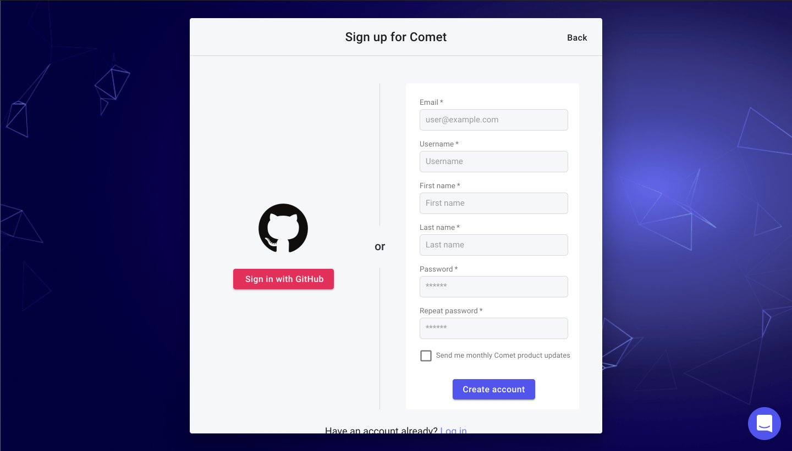
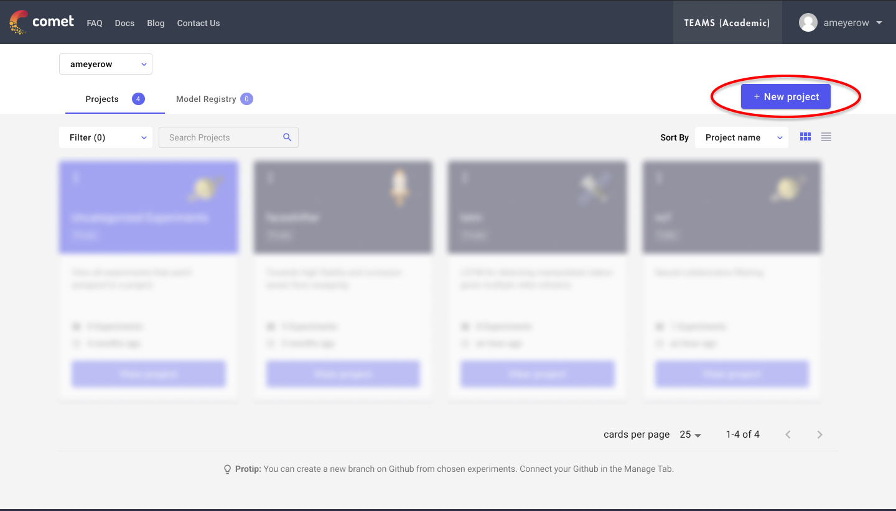
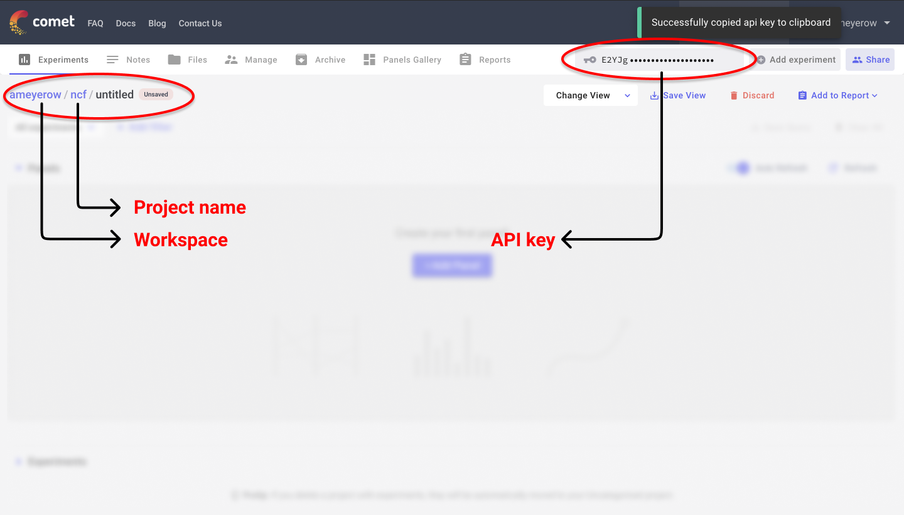
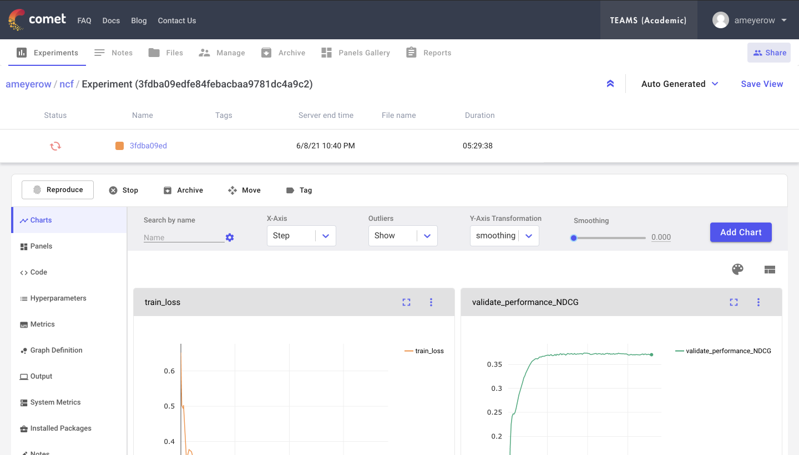

# Quantum Kitchen Sink
This work represents our extension of the public repository implementing the Quantum Kitchen Sink 
[paper](https://arxiv.org/pdf/1806.08321.pdf):

> C. M. Wilson, J. S. Otterbach, N. Tezak, R. S. Smith, A. M. Polloreno, Peter J. Karalekas, S. 
Heidel, M. Sohaib Alam, G. E. Crooks, & M. P. da Silva. (2019). Quantum Kitchen Sinks: An algorithm
for machine learning on near-term quantum computers.

# Prerequisites
Python versions and dependencies are managed with pipenv. If you do not have pipenv already,
install and verify the installation.
```
pip install pipenv
pipenv -h
```

# Comet.ml

Comet.ml is used for logging real-time loss and performance metrics. Setting this up is required for graphs to be 
generated. Begin by [creating an account](https://www.comet.ml/signup) if you don't have one already.



Once logged in, create a new project. There is no code logging by default, so the project can be set to public if the 
model's hyper-parameters do not contain any sensitive information.



On the newly created project page, the following values should be placed in `.comet.config`. Clicking the API key 
will copy it to your clipboard.



After these values are in place, running the training script will result in a new experiment appearing on the project 
page. Loss and performance graphs will be generated once the data arrives 
([example experiment](https://www.comet.ml/ameyerow/ncf/3fdba09edfe84febacbaa9781dc4a9c2)).



Comet.ml can be disabled by passing the `--debug` flag into the training script.
```
python -m src.main --debug
```

# Training
When running the project for the first time, it is necessary to install dependencies. Run the 
following commands from the root directory to properly set up your environment and run the training
script.
```
pipenv install
pipenv shell
python -m src.main
```
To modify a config parameter pass in its name as a flag followed by the desired value. Changing the number of qubits and using tiling, for example, can be done with the following:
```
python -m src.main --qubits 8 --tiling
```
An exhaustive list of flags can be found in `src/utils.py`.

# Uncommon Issues
If you encounter a problem with the virutalenv not activating with pipenv shell, instead activate the environment with the following.

```
# Windows
pipenv --venv
.\[PASTE RESULT OF ABOVE EXPRESSION]\Scripts\activate

# MacOS
ENV_PATH=$(pipenv --venv)
source $ENV_PATH/bin/activate
```

On subsequent runs you can leave out `pipenv install` to activate your environment and run the training script.